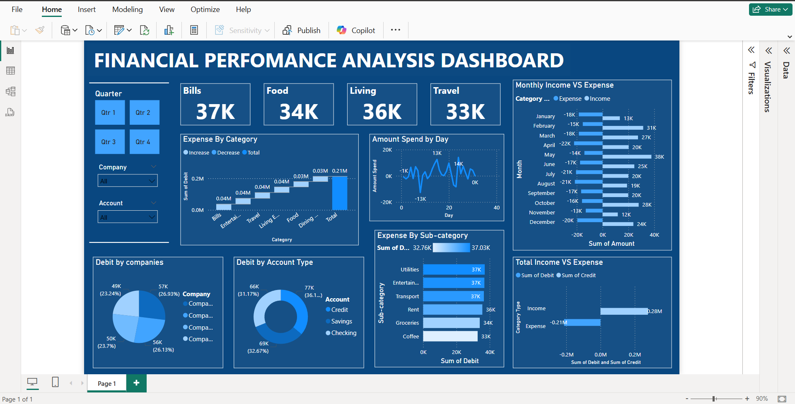

# 💰 Finance Performance Analysis Dashboard | Power BI

## 📌 Overview

The **Finance Performance Analysis Dashboard** is an interactive Power BI project designed to transform raw financial transaction data into meaningful business insights. The dashboard enables stakeholders to monitor income and expenses, identify high-cost areas, evaluate spending behavior, and support data-driven financial decisions through intuitive visualizations.

This project demonstrates end-to-end business intelligence skills, including data preparation, financial KPI analysis, dashboard design, and storytelling.

---

## 🎯 Business Objective

The primary goal of this project is to help businesses gain better visibility into their financial performance by:

* Monitoring income and expense trends over time.
* Identifying the largest cost drivers and spending patterns.
* Comparing financial performance across months.
* Tracking debit transactions by account type and company.
* Enabling faster and more informed business decisions through interactive reporting.

---

## 🛠️ Tools & Technologies

* **Power BI** – Dashboard Development & Data Visualization
* **Microsoft Excel** – Data Cleaning & Preprocessing
* **DAX** – Calculated Measures and KPIs
* **Power Query** – Data Transformation

---

## 📂 Dataset

The dataset contains financial transaction records, including:

* Transaction Date
* Income
* Expense
* Expense Category
* Sub-Category
* Company
* Account Type
* Debit Transactions

The data was cleaned and transformed before being imported into Power BI for analysis.

---

## 📊 Key Performance Indicators (KPIs)

The dashboard answers the following business questions:

* Which expense categories contribute the highest share of total spending?
* On which days does the company spend the most and the least?
* How do monthly income and expenses compare over time?
* What is the overall profit or loss (Income vs. Expenses)?
* Which account types generate the highest number of debit transactions?
* Which companies account for the largest debit transaction amounts?
* Which expense sub-categories contribute the most to total expenditure?

---

## 📈 Dashboard Features

* Executive KPI Cards
* Monthly Income vs. Expense Trend Analysis
* Expense Category Breakdown
* Sub-Category Spending Analysis
* Company-wise Debit Transaction Distribution
* Account Type Analysis
* Daily Spending Trend
* Interactive Filters and Slicers for dynamic exploration

---

## 🔄 Project Workflow

1. Imported the financial transaction dataset.
2. Cleaned and validated the data using Microsoft Excel.
3. Transformed and modeled the dataset in Power BI.
4. Created DAX measures for financial KPIs.
5. Designed an interactive and business-focused dashboard.
6. Performed financial analysis to uncover actionable insights.

---

## 📌 Business Insights

The dashboard helps decision-makers:

* Identify major expense drivers.
* Monitor financial performance month over month.
* Detect spending trends and irregularities.
* Understand transaction distribution across companies and account types.
* Support budgeting, cost optimization, and strategic financial planning.

---

## 🚀 Skills Demonstrated

* Data Cleaning
* Data Modeling
* DAX Calculations
* Financial Analysis
* KPI Development
* Business Intelligence
* Dashboard Design
* Data Storytelling
* Interactive Reporting
* Power BI Best Practices

---

## 📷 Dashboard Preview

---

## ✅ Conclusion

This project demonstrates my ability to convert raw financial data into an interactive business intelligence solution using Power BI. By combining financial analysis with effective data visualization, the dashboard delivers actionable insights that help organizations monitor performance, optimize spending, and make informed business decisions.
